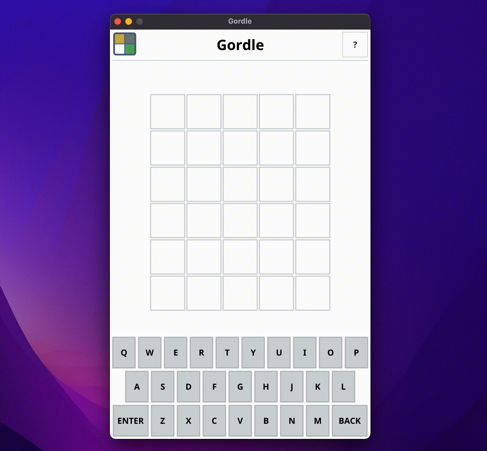

# Gordle – Yet another Wordle clone

[](https://github.com/scastiel/gordle/actions/workflows/go.yml)



## Features

- [x] Works on macOS, should work on Linux and Windows as well (not tested)
- [x] Letter color hints on the keyboard
- [x] Start a new game (without restarting the app)
- [ ] Share your performance
- [ ] Dark theme

## Prerequisites

To compile and run Gordle, you will need to have Go installed on your machine. Refer to the [installation instructions](https://go.dev/doc/install).

## Install

```shell
go install github.com/scastiel/gordle@latest
```

## Run

```shell
gordle
```

## Package

Gordle can be packaged for your operating system using [Fyne](https://fyne.io/). You’ll need to install it first:

```shell
go install fyne.io/fyne/v2/cmd/fyne@latest
```

Then clone this repository, and run the following command:

```shell
fyne package
```

A binary for your OS will be generated in the same directory.

_(Tested only on my Mac M1 for now. Ping me if you tried on another platform and it worked, or not!)_

## License

[MIT, see LICENSE](LICENSE)
